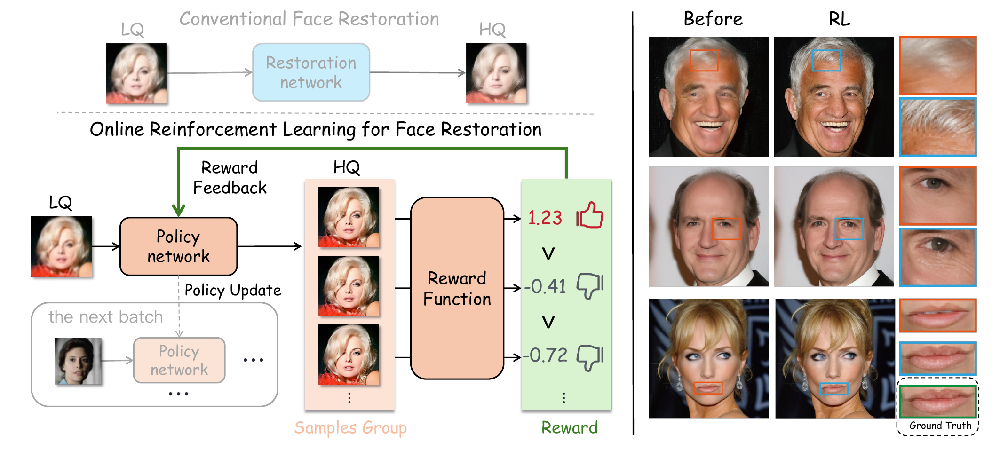
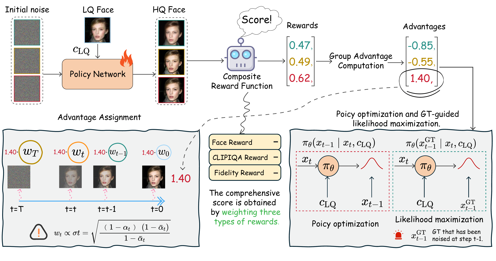

# Beyond the Boundary: RL-Driven Solution Space Exploration for Blind Face Restoration

Official repository for **"Beyond the Boundary: RL-Driven Solution Space Exploration for Blind Face Restoration"** (ECCV 2026).

## Abstract

Blind Face Restoration (BFR) encounters inherent challenges in exploring its large solution space, leading to missing details and identity ambiguity in deterministic outputs. While diffusion models offer powerful generative priors, their potential is often constrained by deterministic sampling processes that lack exploration in the vast solution space. To tackle this, we propose **L**ikelihood-**R**egularized **P**olicy **O**ptimization (LRPO), the first online reinforcement learning (RL) framework that uniquely leverages the inherent stochasticity of diffusion models for the BFR task. Instead of relying on a single deterministic mapping, LRPO systematically explores multiple diverse restoration candidates per input. By evaluating these trajectories, our framework steers the denoising policy towards optimal solutions, significantly increasing the likelihood of high-quality outputs. To effectively facilitate this exploration mechanism, LRPO incorporates three key innovations: 1) a composite reward function balancing human preference and fidelity, 2) ground-truth guided likelihood regularization, and 3) a noise-level advantage assignment. Extensive experiments demonstrate that LRPO significantly improves face restoration quality over baselines and achieves *state-of-the-art* performance.

<p align="center">
  
</p>

> **Figure 1.** (Left) Our online RL-based face restoration framework: an LQ face is fed to the policy network πθ, which generates a group of HQ candidates; the reward function scores each candidate and converts the scores into within-group relative advantages that guide policy optimization. (Right) Comparisons show the quality improvement from RL optimization over the base model.

<p align="center">
  
</p>

> **Figure 2.** Overview of the LRPO framework. The policy network produces multiple HQ restoration candidates from a single LQ input, which are assessed by the reward function and transformed into advantage scores. The framework assigns weighted advantages to individual denoising steps and integrates ground-truth-guided likelihood regularization into the RL objective to maintain fidelity.

## Environment

```bash
conda create -n lrpo python=3.10 -y && conda activate lrpo
pip install -r requirements_inference.txt   # inference only
pip install -r requirements.txt             # training (adds accelerate / deepspeed)
```

`torch` pulls its own consistent CUDA-12 stack — do **not** pin `nvidia-*` wheels.
Training is validated **only** with `accelerate==1.7.0` (pinned in `requirements.txt`); other
versions change the DeepSpeed gradient-accumulation behaviour and alter the training dynamics.

## Weights

All weights are hosted on **[Hugging Face — `wubin1928/BFR_RL`](https://huggingface.co/wubin1928/BFR_RL)**. Download them into `./weights/`:

```bash
pip install -U "huggingface_hub[cli]"
hf download wubin1928/BFR_RL --local-dir ./weights
```


| file | description |
|---|---|
| `lrpo_fidelity.pth` | **LRPO ControlNet — paper model, fidelity-oriented** (ours) |
| `lrpo_perception.pth` | **LRPO ControlNet — perception-oriented**, no GT-likelihood regularization (ours, supplementary) |
| `v1_face.pth` | DiffBIR-v1 face ControlNet (base) |
| `face_swinir_v1.ckpt` | DiffBIR SwinIR-face stage-1 (base) |
| `v2-1_512-ema-pruned.ckpt` | Stable Diffusion 2.1-base |
| `FaceRewardModel.pth` | face reward model (**training only**) |
| `ffhq_captions.tar.gz` | FFHQ per-image captions (**training only** — see [Training](#training) step 1) |

We release two LRPO weights: `lrpo_fidelity.pth` (the paper model, balances fidelity) and
`lrpo_perception.pth` (drops the GT-likelihood regularization for stronger perceptual quality).
They share the same inference command — pick by your fidelity↔perception preference.

## Inference

```bash
python inference.py --task face --version v1_refl \
  --diffbir_refl_path ./weights/lrpo_fidelity.pth \
  --captioner none --pos_prompt "" \
  --neg_prompt "low quality,blurry,low-resolution,noisy,unsharp,weird textures" \
  --cfg_scale 1.0 --sampler ddim --steps 50 --precision bf16 \
  --input <LQ dir> --output <output dir>
```

Swap `--diffbir_refl_path` to `lrpo_perception.pth` for the perception-oriented model.
The DDIM sampler uses η=0.8 internally (set in `diffbir/pipeline.py`); with the fixed seed,
outputs are reproducible on the same machine.

**Test sets.** The synthetic benchmark (CelebA-Test) and the real-world benchmarks (LFW-Test,
WebPhoto-Test) follow [TencentARC/VQFR](https://github.com/TencentARC/VQFR) — download them there
and point `--input` to each low-quality folder.

## Training

**1. Data.** Download the FFHQ dataset (512×512 images) from
[NVlabs/ffhq-dataset](https://github.com/NVlabs/ffhq-dataset). We provide the per-image captions in
`ffhq_captions.tar.gz` (included in the weights download above): extract it and place each
`NNNNN.txt` **next to the matching `NNNNN.png` in the same folder** — the dataloader reads the
caption from the `.txt` beside each image. Then write a file list (one image path per line) and
point `dataset.train.params.file_list` in `configs/train/train_lrpo.yaml` to it. You only need the
HQ images + captions; the low-quality inputs are synthesized online by the dataloader
(blur / downsample / noise / JPEG).

**2. Weights.** Download the base weights and `FaceRewardModel.pth` (see [Weights](#weights))
into `./weights/`.

**3. Reward server.** Training queries a local reward server at `127.0.0.1:18085` — start it
first, on the same machine (it has its own deps in `reward_server_requirments.txt`):

```bash
cd reward_server
CUDA_VISIBLE_DEVICES=0 gunicorn -c gunicorn.conf.py "app_face_reward:create_app()"
```

The composite reward and its weights (face 0.3 / lpips 0.3 / clipiqa 0.1 / dwt 0.3) are defined
in `reward_server/app_face_reward.py`.

**4. Train.** Multi-GPU via `accelerate` + DeepSpeed ZeRO-2:

```bash
accelerate launch --num_processes 3 --main_process_port 29500 \
  train_lrpo.py --config configs/train/train_lrpo.yaml
```

Inference-ready ControlNet weights are written to
`<exp_dir>/checkpoints/controlnet_epoch_*_step_*.pth` every `ckpt_every` steps, directly usable as
`--diffbir_refl_path`. To log to Weights & Biases, set `train.log_record: wandb` in the config and
`export WANDB_API_KEY=...`.

> **Reproducibility:** do **not** add `gradient_accumulation_steps` to
> `configs/train/cldm_ds_config.json` — DeepSpeed must default to 1 (one optimizer update per
> micro-step). The `Accelerator(gradient_accumulation_steps=...)` in `train_lrpo.py` only sets the
> logging cadence. This pairing reproduces the paper and is validated with `accelerate==1.7.0`.

## License

Released under the [Apache License 2.0](LICENSE) — free to use, modify, and distribute.

## Contact

Questions: winhappybird@gmail.com
